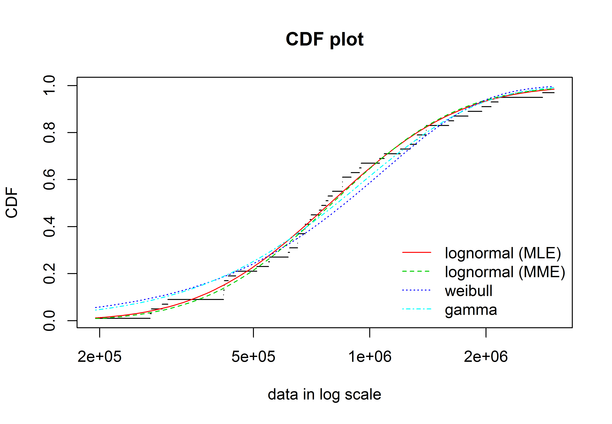
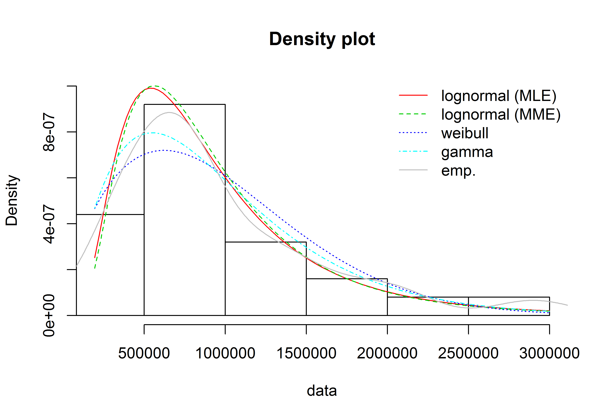
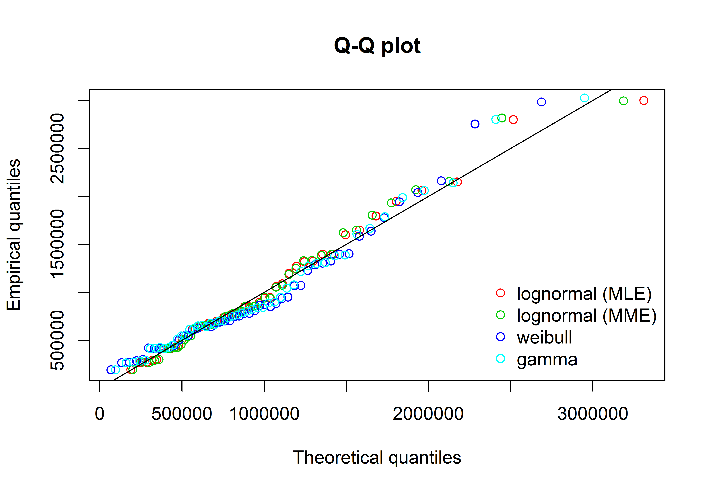

# Resumo {-}

Pretende-se com este artigo detalhar o motivo pelo qual a transformação de variável dependente pela função logaritmo é frequentemente adequada na área de avaliação de imóveis. Um procedimento muito comum nesta área é a adoção de transformações para a obtenção de um "melhor" modelo de regressão. A mais usual e preferida de muitos avaliadores é a função logaritmo, especialmente para a variável dependente. Muitas vezes esta transformação é adequada e percebe-se uma notória melhora no ajuste do modelo. Outras vezes, esta transformação pode não ser adequada. Apesar do modelo aparentar-se melhor ajustado, problemas podem ocorrer quanto às verificações das hipóteses clássicas da regressão, as quais nem sempre os avaliadores estão tão atentos quanto estão com as verificações dos intervalos de confiança e níveis de significância. No entanto, o avaliador que assim procede estará verificando intervalos de confiança e níveis de significâncias incorretos, haja vista que a hipótese da heteroscedasticidade implica na incorreção destas inferências. Entendemos que a melhor maneira para apresentar aos avaliadores a importância de criteriosas escolhas de transformações seja através da análise do histograma da variável original e transformada. Normalmente, uma boa escolha de transformação leva à uma distribuição aproximadamente normal. Quando a variável dependente apresenta distribuição lognormal, esta transformação é a transformação logaritmica. Desta maneira, demonstramos as características básicas desta distribuição, sua formulação, características além do seu relacionamento com a distribuição normal. Por fim, demonstramos as implicações da adoção da transformação da variável dependente e abordamos o problema da retransformação da variável dependente à sua escala original.

# INTRODUÇÃO

A transformação de variáveis é um procedimento comum na Engenharia de Avaliações. No entanto, a transformação dos dados por vezes é realizada sem uma análise profunda do comportamento das variáveis. A *Food and Drug Administration* (FDA), órgão federal dos EUA que atua no controle da comercialização de alimentos e medicamentos no país, recomenda:

> A transformação desnecessária de dados deve ser evitada. Caso tenha sido realizada transformação de dados, uma justificativa para a escolha da transformação junto com a interpretação das estimativas dos efeitos do tratamento com base nos dados transformados deve ser fornecida.[@fda apud @keene]

No entanto, a transformação logarítmica é especial, por uma série de aspectos, como pode ser visto em @keene.

A distribuição lognormal apresenta diversas aplicações práticas. É comum, na área de avaliação de imóveis, mas não apenas[^1], nos depararmos com dados que seguem esta distribuição. Neste artigo pretendemos demonstrar as principais características da distribuição lognormal, sua relação com a distribuição normal de Gauss, assim como debatemos a melhor maneira de se lidar com dados lognormais.

[^1]: Dados estritamente positivos, como valores em moeda, altura, peso, etc, normalmente seguem a distribuição lognormal.

# REVISÃO BIBLIOGRÁFICA

## Formulação

A formulação da distribuição lognormal para os parâmetros $\mu$ e $\sigma$ pode ser vista abaixo [@farias]

$$\begin{cases}
f(x;\mu, \sigma) = \frac{1}{x\sigma\sqrt{2\pi}}\exp(-\frac{(log(x) - \mu)^2}{2\sigma^2}) & \forall x > 0 \\ 
0 & \text{ se } x = 0 
\end{cases}$$


## Propriedades

### Valor Esperado e Variância

O valor Esperado $\mathbb{E}$ de uma variável aleatória com distribuição lognormal $X$ é [@farias]:

$$\mathbb{E}(X) = \exp \left (\mu + \frac{\sigma^2}{2} \right )$$
E sua variância é:

$$\newcommand{\Var}{\operatorname{Var}} \Var(X) = \exp (2\mu+\sigma^2)(\exp(\sigma^2)-1)$$


### Medidas de Tendência Central

A figura \ref{fig:densidade_medidas} mostra a posição das medidas de tendência central (moda, média e mediana) para um variável aleatória de distribuição log-normal.

<div class="figure" style="text-align: center">

<p class="caption">Ilustração das posições de medidas de tendência central numa distribuição lognormal.</p>
</div>

### Efeito das variações do desvio-padrão na forma da distribuição

<div class="figure" style="text-align: center">

<p class="caption">Distribuição lognormal com $\mu = 0$ e diversos valores de $\sigma$</p>
</div>

### Relação com a distribuição normal

Lembrando que a função densidade de probabilidade de uma variável aleatória com distribuição normal é dada por:

$$f(t) = \frac{1}{\sigma\sqrt{2\pi}}\mathrm{e}^{-\frac{1}{2}\frac{(t-\mu)^2}{\sigma^2}}$$
E que para a distribuição normal-padrão ($N(0,1)$) a função densidade de probabilidade torna-se:

$$\varphi(t) = \frac{1}{\sqrt{2\pi}}\mathrm{e}^{-\frac{1}{2}t^2}$$

Seja $X$ uma variável aleatória de distribuição normal padronizada ($X \sim N(0, 1)$), $f_X$ a função densidade de probabilidade e $Y = e^X$. Então ($F_Y$) é igual a: 

$$F_Y(y) = \mathbb{P}(e^X\leq y) = \mathbb{P}(X \leq ln(Y)) = \int_{-\infty}^{ln(y)}f_X(x)dx = \int_{-\infty}^{ln(y)}\frac{1}{\sqrt{2\pi}}e^{-x^2/2}dx$$
o que equivale a:

$$F_Y(y) = \int_{0}^{y}\frac{1}{x}\frac{1}{\sqrt{2\pi}}e^{-ln(x)^2/2}$$

Ou seja, a distribuição de uma variável $Y = e^X$, em que $X \sim N(0,1)$ é equivalente a distribuição de uma variável lognormal com parâmetros $\mu = 0$ e $\sigma = 1$.

A figura \ref{fig:normal_lognormal} ilustra este fato.

<div class="figure" style="text-align: center">

<p class="caption">Comparação entre distribuições normal e lognormal padronizadas.</p>
</div>


### Analogia com o Teorema do Limite Central

Assim como o resultado da soma de diversas variáveis independentes com distribuições quaisquer resulta numa variável aleatória de distribuição normal (Teorema do Limite Central), o produto de diversas variáveis aleatórias resulta numa distribuição lognormal.

# EXEMPLO

## Dados

Os dados utilizados aqui são oriundos de Hochheim [-@hochheim, 21-22] e são reproduzidos no [ANEXO I].


## Ajuste de distribuições aos dados




## Gráficos

As figuras \ref{fig:densidade} e \ref{fig:hist_densidade} mostram que os valores observados para a variável \code{valor} do conjunto de dados mencionados acima [@hochheim, 21-22] apresentam distribuição aproximadamente lognormal, com parâmetros $\mu = \bar{ln(valor)}$

\newpage

a. Densidade

<div class="figure" style="text-align: center">

<p class="caption">Função densidade de probabilidade com parâmetros obtidos dos dados da variável \code{valor}</p>
</div>

b. Histograma com densidade superposta

<div class="figure" style="text-align: center">

<p class="caption">Histograma das variável \code{valor} com função densidade de probabilidade superposta.</p>
</div>

c. Cumulativa

<div class="figure" style="text-align: center">

<p class="caption">Função cumulativa de densidade de probabilidade com parâmetros obtidos dos dados da variável \code{valor}</p>
</div>

d. Distribuição da variável $ln(valor)$

A figura \ref{fig:hist_densidade2}

<div class="figure" style="text-align: center">

<p class="caption">Histograma com função densidade de probabilidade normal superposta</p>
</div>

## Modelos

Detectando-se a presença de variável resposta com distribuição lognormal, pode-se proceder da seguinte maneira:

### Modelo linear com a variável resposta transformada

É fácil mostrar que o modelo linear com a variável resposta logaritmizada, ou seja, com distribuição normal, é melhor ajustado que o modelo linear de uma variável resposta lognormal. Além disso, o modelo linear, sem transformação, é heteroscedástico.


```
## 
## 	studentized Breusch-Pagan test
## 
## data:  fit
## BP = 17.882753, df = 7, p-value = 0.01251035
```


A função máxima verossimilhança de Box-Cox também vai apresentar como transformação ótima a transformação logarítimica, como demonstra a figura \ref{fig:boxcox}

<div class="figure" style="text-align: center">

<p class="caption">Gráfico da função verossimilhança de Box-Cox</p>
</div>

Na tabela \ref{tab:tabela} é possível comparar os modelos com e sem a transformação da variável resposta. Porém, como o modelo sem transformação é heteroscedástico, os intervalos de confiança dos regressores e os p-valores mostrados na  tabela são inválidos, pois deve-se calcular os erros robustos antes de computá-los, o que será visto na próxima seção.


<table style="text-align:center"><caption><strong>Comparação entre modelos com e sem transformação da variável resposta</strong></caption>
<tr><td colspan="3" style="border-bottom: 1px solid black"></td></tr><tr><td style="text-align:left"></td><td colspan="2"><em>Dependent variable:</em></td></tr>
<tr><td></td><td colspan="2" style="border-bottom: 1px solid black"></td></tr>
<tr><td style="text-align:left"></td><td>valor</td><td>log(valor)</td></tr>
<tr><td style="text-align:left"></td><td>(1)</td><td>(2)</td></tr>
<tr><td colspan="3" style="border-bottom: 1px solid black"></td></tr><tr><td style="text-align:left">area_total</td><td>2,893.178</td><td>0.002</td></tr>
<tr><td style="text-align:left"></td><td>(2,065.405, 3,720.951)</td><td>(0.001, 0.002)</td></tr>
<tr><td style="text-align:left"></td><td>t = 6.850</td><td>t = 4.886</td></tr>
<tr><td style="text-align:left"></td><td>p = 0.00000<sup>***</sup></td><td>p = 0.00002<sup>***</sup></td></tr>
<tr><td style="text-align:left"></td><td></td><td></td></tr>
<tr><td style="text-align:left">quartos</td><td>73,524.375</td><td>0.169</td></tr>
<tr><td style="text-align:left"></td><td>(-34,814.143, 181,862.894)</td><td>(0.084, 0.255)</td></tr>
<tr><td style="text-align:left"></td><td>t = 1.330</td><td>t = 3.870</td></tr>
<tr><td style="text-align:left"></td><td>p = 0.191</td><td>p = 0.0004<sup>***</sup></td></tr>
<tr><td style="text-align:left"></td><td></td><td></td></tr>
<tr><td style="text-align:left">suites</td><td>111,000.591</td><td>0.088</td></tr>
<tr><td style="text-align:left"></td><td>(8,045.131, 213,956.052)</td><td>(0.007, 0.170)</td></tr>
<tr><td style="text-align:left"></td><td>t = 2.113</td><td>t = 2.121</td></tr>
<tr><td style="text-align:left"></td><td>p = 0.041<sup>**</sup></td><td>p = 0.040<sup>**</sup></td></tr>
<tr><td style="text-align:left"></td><td></td><td></td></tr>
<tr><td style="text-align:left">garagens</td><td>148,427.448</td><td>0.175</td></tr>
<tr><td style="text-align:left"></td><td>(49,657.102, 247,197.795)</td><td>(0.097, 0.253)</td></tr>
<tr><td style="text-align:left"></td><td>t = 2.945</td><td>t = 4.394</td></tr>
<tr><td style="text-align:left"></td><td>p = 0.006<sup>***</sup></td><td>p = 0.0001<sup>***</sup></td></tr>
<tr><td style="text-align:left"></td><td></td><td></td></tr>
<tr><td style="text-align:left">dist_b_mar</td><td>-223.217</td><td>-0.0003</td></tr>
<tr><td style="text-align:left"></td><td>(-434.862, -11.571)</td><td>(-0.0004, -0.0001)</td></tr>
<tr><td style="text-align:left"></td><td>t = -2.067</td><td>t = -3.215</td></tr>
<tr><td style="text-align:left"></td><td>p = 0.045<sup>**</sup></td><td>p = 0.003<sup>***</sup></td></tr>
<tr><td style="text-align:left"></td><td></td><td></td></tr>
<tr><td style="text-align:left">padraomedio</td><td>-146,549.393</td><td>0.268</td></tr>
<tr><td style="text-align:left"></td><td>(-354,850.457, 61,751.672)</td><td>(0.103, 0.433)</td></tr>
<tr><td style="text-align:left"></td><td>t = -1.379</td><td>t = 3.190</td></tr>
<tr><td style="text-align:left"></td><td>p = 0.176</td><td>p = 0.003<sup>***</sup></td></tr>
<tr><td style="text-align:left"></td><td></td><td></td></tr>
<tr><td style="text-align:left">padraoalto</td><td>-56,064.550</td><td>0.334</td></tr>
<tr><td style="text-align:left"></td><td>(-264,003.525, 151,874.426)</td><td>(0.169, 0.498)</td></tr>
<tr><td style="text-align:left"></td><td>t = -0.528</td><td>t = 3.975</td></tr>
<tr><td style="text-align:left"></td><td>p = 0.600</td><td>p = 0.0003<sup>***</sup></td></tr>
<tr><td style="text-align:left"></td><td></td><td></td></tr>
<tr><td style="text-align:left">Constant</td><td>33,953.788</td><td>12.315</td></tr>
<tr><td style="text-align:left"></td><td>(-267,469.800, 335,377.375)</td><td>(12.076, 12.553)</td></tr>
<tr><td style="text-align:left"></td><td>t = 0.221</td><td>t = 101.170</td></tr>
<tr><td style="text-align:left"></td><td>p = 0.827</td><td>p = 0.000<sup>***</sup></td></tr>
<tr><td style="text-align:left"></td><td></td><td></td></tr>
<tr><td colspan="3" style="border-bottom: 1px solid black"></td></tr><tr><td style="text-align:left">Observations</td><td>50</td><td>50</td></tr>
<tr><td style="text-align:left">R<sup>2</sup></td><td>0.906</td><td>0.940</td></tr>
<tr><td style="text-align:left">Adjusted R<sup>2</sup></td><td>0.890</td><td>0.930</td></tr>
<tr><td style="text-align:left">Akaike Inf. Crit.</td><td>1,375.659</td><td>-29.275</td></tr>
<tr><td style="text-align:left">Residual Std. Error (df = 42)</td><td>207,903.003</td><td>0.165</td></tr>
<tr><td style="text-align:left">F Statistic (df = 7; 42)</td><td>57.731<sup>***</sup></td><td>94.063<sup>***</sup></td></tr>
<tr><td colspan="3" style="border-bottom: 1px solid black"></td></tr><tr><td style="text-align:left"><em>Note:</em></td><td colspan="2" style="text-align:right"><sup>*</sup>p<0.1; <sup>**</sup>p<0.05; <sup>***</sup>p<0.01</td></tr>
</table>

## Retransformação de variáveis

O problema da transformação da variável resposta no logarítmo da variável resposta original, é que devemos estudar como proceder na retranformação da variável, para efetuar a avaliação do imóvel.

### A desigualdade de Jensen

Segundo Matloff [-@matloff2017, 142], a desigualdade de Jensen (aplicada à estatística) se traduz na seguinte expressão, válida para funções convexas:

$$\mathbb{E}[h(V)] \geq h(\mathbb{E}[V])$$

Isto aplicado no caso da transformação logarítimica, que é uma função côncava, se reduz à expressão abaixo [@matloff2017, 142]:

$$\mathbb{E}[\ln Y|X = t] \leq \ln(E[Y|X = t])$$

Para Matloff, então, como a igualdade só irá acontecer em poucos casos especiais, a função de regressão de $\ln(Y)$ será quase sempre menor do que o logaritmo natural da função de regressão de $Y$, de tal forma que a suposição que dado uma variável aleatória $Y$ tal que assumimos que $E(Y|X = t) = e^{\beta_0 + \beta_1t}$, não podemos concluir de imediato que um modelo linear razoável seria da forma $E(\ln Y|X = t) = \beta_0 + \beta_1t$, pois, pela desigualdade de Jensen, se temos dados significantemente heteroscedásticos da variável original ($Y$), a discrepância entre os dois lados da desigualdade acima poderia variar bastante com $t$, potencialmente produzindo uma grande distorção à forma da curva de regressão [@matloff2017, 143]. Segundo Becker [-@becker, 4], a desigualdade de Jensen pode ser transformada numa igualdade do tipo:

$$\mathbb{E}[f(X)] = f(\mathbb{E}[X]) + \Delta$$
E, de acordo com o mesmo [-@becker, 5], o valor de $\Delta$, chamado de Defeito de Holder, é proporcional à variância da variável aleatória $X$, tal que se $f: [a, b] \rightarrow \mathbb{R}$ é duas vezes continuamente diferenciável e existem limites finitos $m$ e $M$ tais que $0 \leq m \leq f''(x) \leq M$ para todo $x \in [a,b]$, então existe um valor $\mu \in [m, M]$ para o qual a fórmula abaixo é válida:

$$\mathbb{E}[f(X)] - f(\mathbb{E}[X]) = \frac{1}{2}\mu \mathrm{Var} (X)$$
Em suma, o valor de $\Delta$ é proporcional à variância de $X$ ($\Delta \propto \sigma^2(X)$).

Deste modo, existem na literatura diversos estudos sobre qual seria o "melhor" estimador -- paramétrico ou não-paramétrico -- para a variável resposta original, quando da ocorrência da transformação da variável pela função logaritmo natural, como pode ser visto em @Duan, @meulenberg1965 e @shen.

Entendemos que, na precisão necessária para a área de avaliação de imóveis, é suficiente a adoção do estimador teórico, apesar do funcionamento dos estimadores não-paramétricos ter sido demonstrado mais eficiente do que ele.

$$\mathbb{E}(Y|X) = \exp(\beta_0 + \beta_1X + 0.5\sigma^2)$$

### Modelo linear com posterior correção da heteroscedasticidade

#### Erros-padrão robustos

a. Coeficientes

<table style="text-align:center"><caption><strong>Comparação entre modelos com e sem erros robustos</strong></caption>
<tr><td colspan="3" style="border-bottom: 1px solid black"></td></tr><tr><td style="text-align:left"></td><td colspan="2"><em>Dependent variable:</em></td></tr>
<tr><td></td><td colspan="2" style="border-bottom: 1px solid black"></td></tr>
<tr><td style="text-align:left"></td><td colspan="2">valor</td></tr>
<tr><td style="text-align:left"></td><td>default</td><td>robust</td></tr>
<tr><td style="text-align:left"></td><td>(1)</td><td>(2)</td></tr>
<tr><td colspan="3" style="border-bottom: 1px solid black"></td></tr><tr><td style="text-align:left">area_total</td><td>2,893.178</td><td>2,893.178</td></tr>
<tr><td style="text-align:left"></td><td>(2,065.405, 3,720.951)</td><td>(1,712.055, 4,074.302)</td></tr>
<tr><td style="text-align:left"></td><td>t = 6.850</td><td>t = 4.801</td></tr>
<tr><td style="text-align:left"></td><td>p = 0.00000<sup>***</sup></td><td>p = 0.00001<sup>***</sup></td></tr>
<tr><td style="text-align:left"></td><td></td><td></td></tr>
<tr><td style="text-align:left">quartos</td><td>73,524.375</td><td>73,524.375</td></tr>
<tr><td style="text-align:left"></td><td>(-34,814.143, 181,862.894)</td><td>(-31,897.755, 178,946.506)</td></tr>
<tr><td style="text-align:left"></td><td>t = 1.330</td><td>t = 1.367</td></tr>
<tr><td style="text-align:left"></td><td>p = 0.191</td><td>p = 0.172</td></tr>
<tr><td style="text-align:left"></td><td></td><td></td></tr>
<tr><td style="text-align:left">suites</td><td>111,000.591</td><td>111,000.591</td></tr>
<tr><td style="text-align:left"></td><td>(8,045.131, 213,956.052)</td><td>(18,671.249, 203,329.934)</td></tr>
<tr><td style="text-align:left"></td><td>t = 2.113</td><td>t = 2.356</td></tr>
<tr><td style="text-align:left"></td><td>p = 0.041<sup>**</sup></td><td>p = 0.019<sup>**</sup></td></tr>
<tr><td style="text-align:left"></td><td></td><td></td></tr>
<tr><td style="text-align:left">garagens</td><td>148,427.448</td><td>148,427.448</td></tr>
<tr><td style="text-align:left"></td><td>(49,657.102, 247,197.795)</td><td>(73,906.905, 222,947.992)</td></tr>
<tr><td style="text-align:left"></td><td>t = 2.945</td><td>t = 3.904</td></tr>
<tr><td style="text-align:left"></td><td>p = 0.006<sup>***</sup></td><td>p = 0.0001<sup>***</sup></td></tr>
<tr><td style="text-align:left"></td><td></td><td></td></tr>
<tr><td style="text-align:left">dist_b_mar</td><td>-223.217</td><td>-223.217</td></tr>
<tr><td style="text-align:left"></td><td>(-434.862, -11.571)</td><td>(-406.588, -39.845)</td></tr>
<tr><td style="text-align:left"></td><td>t = -2.067</td><td>t = -2.386</td></tr>
<tr><td style="text-align:left"></td><td>p = 0.045<sup>**</sup></td><td>p = 0.018<sup>**</sup></td></tr>
<tr><td style="text-align:left"></td><td></td><td></td></tr>
<tr><td style="text-align:left">padraomedio</td><td>-146,549.393</td><td>-146,549.393</td></tr>
<tr><td style="text-align:left"></td><td>(-354,850.457, 61,751.672)</td><td>(-322,293.226, 29,194.441)</td></tr>
<tr><td style="text-align:left"></td><td>t = -1.379</td><td>t = -1.634</td></tr>
<tr><td style="text-align:left"></td><td>p = 0.176</td><td>p = 0.103</td></tr>
<tr><td style="text-align:left"></td><td></td><td></td></tr>
<tr><td style="text-align:left">padraoalto</td><td>-56,064.550</td><td>-56,064.550</td></tr>
<tr><td style="text-align:left"></td><td>(-264,003.525, 151,874.426)</td><td>(-197,646.893, 85,517.794)</td></tr>
<tr><td style="text-align:left"></td><td>t = -0.528</td><td>t = -0.776</td></tr>
<tr><td style="text-align:left"></td><td>p = 0.600</td><td>p = 0.438</td></tr>
<tr><td style="text-align:left"></td><td></td><td></td></tr>
<tr><td style="text-align:left">Constant</td><td>33,953.788</td><td>33,953.788</td></tr>
<tr><td style="text-align:left"></td><td>(-267,469.800, 335,377.375)</td><td>(-191,823.586, 259,731.161)</td></tr>
<tr><td style="text-align:left"></td><td>t = 0.221</td><td>t = 0.295</td></tr>
<tr><td style="text-align:left"></td><td>p = 0.827</td><td>p = 0.769</td></tr>
<tr><td style="text-align:left"></td><td></td><td></td></tr>
<tr><td colspan="3" style="border-bottom: 1px solid black"></td></tr><tr><td style="text-align:left">Observations</td><td>50</td><td>50</td></tr>
<tr><td style="text-align:left">R<sup>2</sup></td><td>0.906</td><td>0.906</td></tr>
<tr><td style="text-align:left">Adjusted R<sup>2</sup></td><td>0.890</td><td>0.890</td></tr>
<tr><td style="text-align:left">Akaike Inf. Crit.</td><td>1,375.659</td><td>1,375.659</td></tr>
<tr><td style="text-align:left">Residual Std. Error (df = 42)</td><td>207,903.003</td><td>207,903.003</td></tr>
<tr><td style="text-align:left">F Statistic (df = 7; 42)</td><td>57.731<sup>***</sup></td><td>57.731<sup>***</sup></td></tr>
<tr><td colspan="3" style="border-bottom: 1px solid black"></td></tr><tr><td style="text-align:left"><em>Note:</em></td><td colspan="2" style="text-align:right"><sup>*</sup>p<0.1; <sup>**</sup>p<0.05; <sup>***</sup>p<0.01</td></tr>
</table>

b. Teste F

Na tabela \ref{tab:tabela2}, o resultado para o teste F para o modelo robusto está errado. O teste deve ser refeito com a consideração dos erros robustos:


```
## Wald test
## 
## Model 1: valor ~ area_total + quartos + suites + garagens + dist_b_mar + 
##     padrao
## Model 2: valor ~ 1
##   Res.Df Df        F     Pr(>F)    
## 1     42                           
## 2     49 -7 33.42548 3.3877e-15 ***
## ---
## Signif. codes:  0 '***' 0.001 '**' 0.01 '*' 0.05 '.' 0.1 ' ' 1
```

### Comparação das previsões para os dois modelos 


|          fit|          lwr|          upr| amplitude|
|------------:|------------:|------------:|---------:|
| 1.106.966,61| 1.012.097,40| 1.210.728,40|      0,18|
|   665.565,24|   624.364,31|   709.484,96|      0,13|
|   889.515,06|   839.323,09|   942.708,54|      0,12|
|   778.638,69|   732.296,73|   827.913,31|      0,12|
|   926.373,32|   826.896,03| 1.037.817,93|      0,23|
|   366.492,31|   337.377,96|   398.119,10|      0,17|
|   720.258,16|   676.775,68|   766.534,37|      0,12|
|   679.913,27|   635.304,18|   727.654,68|      0,14|
|   677.695,98|   633.095,02|   725.439,04|      0,14|
|   703.407,28|   661.531,44|   747.933,93|      0,12|
|   855.019,06|   805.611,95|   907.456,25|      0,12|
|   743.187,12|   699.766,15|   789.302,39|      0,12|
|   747.511,83|   703.804,25|   793.933,73|      0,12|
|   479.030,46|   425.602,14|   539.165,94|      0,24|
|   685.488,30|   640.831,29|   733.257,28|      0,13|
| 1.339.514,49| 1.217.160,39| 1.474.168,13|      0,19|
| 1.116.148,08| 1.040.974,23| 1.196.750,59|      0,14|
|   663.458,78|   618.767,51|   711.377,93|      0,14|
|   712.383,70|   668.349,56|   759.319,03|      0,13|
|   431.580,00|   389.600,88|   478.082,34|      0,21|
|   243.707,09|   218.091,05|   272.331,87|      0,22|
|   483.061,17|   436.055,79|   535.133,57|      0,21|
|   629.182,10|   579.007,59|   683.704,53|      0,17|
|   778.457,88|   730.734,27|   829.298,28|      0,13|
|   720.258,16|   676.775,68|   766.534,37|      0,12|
|   385.471,14|   354.491,70|   419.157,91|      0,17|
|   236.922,70|   216.532,40|   259.233,11|      0,18|
|   289.533,09|   265.323,28|   315.951,95|      0,17|
|   233.663,54|   209.605,75|   260.482,61|      0,22|
|   398.390,85|   358.851,53|   442.286,72|      0,21|
|   660.321,06|   621.395,99|   701.684,44|      0,12|
|   465.669,76|   433.446,51|   500.288,54|      0,14|
| 1.582.956,13| 1.443.690,00| 1.735.656,62|      0,18|
| 2.532.821,47| 2.218.551,51| 2.891.609,49|      0,27|
|   970.590,45|   911.737,58| 1.033.242,29|      0,13|
| 1.219.926,54| 1.095.450,47| 1.358.546,82|      0,22|
| 1.022.195,60|   909.895,02| 1.148.356,49|      0,23|
| 1.129.958,73| 1.033.156,70| 1.235.830,67|      0,18|
| 2.093.864,11| 1.905.595,34| 2.300.733,44|      0,19|
| 1.938.988,72| 1.716.090,88| 2.190.838,08|      0,24|
| 1.506.487,83| 1.389.422,95| 1.633.415,93|      0,16|
| 3.464.954,28| 3.132.699,80| 3.832.447,71|      0,20|
| 1.178.021,65| 1.080.266,41| 1.284.622,95|      0,17|
|   695.650,38|   633.799,37|   763.537,29|      0,19|
|   653.267,76|   595.450,52|   716.698,95|      0,19|
| 2.284.770,17| 2.093.977,72| 2.492.946,64|      0,17|
| 1.639.750,58| 1.523.582,17| 1.764.776,47|      0,15|
|   813.100,32|   762.277,24|   867.311,91|      0,13|
| 1.587.840,38| 1.464.634,52| 1.721.410,37|      0,16|
|   802.909,81|   750.036,73|   859.510,12|      0,14|

| predicted.value|         se|     ci.lower|     ci.upper| amplitude|
|---------------:|----------:|------------:|------------:|---------:|
|    1.367.729,29| 121.445,88| 1.212.090,13| 1.523.368,45|      0,23|
|      614.058,83|  54.198,28|   544.600,94|   683.516,72|      0,23|
|      899.907,02|  44.247,13|   843.202,04|   956.611,99|      0,13|
|      801.067,23|  58.642,85|   725.913,40|   876.221,07|      0,19|
|      910.856,15| 108.475,03|   771.839,81| 1.049.872,49|      0,31|
|      445.349,38|  61.718,67|   366.253,72|   524.445,03|      0,36|
|      844.240,07|  47.795,77|   782.987,32|   905.492,82|      0,15|
|      647.454,84|  49.257,70|   584.328,56|   710.581,11|      0,19|
|      641.668,48|  49.966,95|   577.633,26|   705.703,70|      0,20|
|      615.796,95|  61.632,22|   536.812,09|   694.781,81|      0,26|
|      875.975,41|  44.110,21|   819.445,89|   932.504,92|      0,13|
|      710.610,82|  56.922,62|   637.661,54|   783.560,10|      0,21|
|      767.022,76|  56.073,26|   695.161,99|   838.883,53|      0,19|
|      655.918,20| 107.651,38|   517.957,41|   793.878,99|      0,42|
|      661.920,73|  47.597,42|   600.922,18|   722.919,27|      0,18|
|    1.242.341,34| 108.121,24| 1.103.778,40| 1.380.904,29|      0,22|
|    1.223.757,21|  61.228,63| 1.145.289,57| 1.302.224,86|      0,13|
|      604.057,16|  55.122,03|   533.415,44|   674.698,89|      0,23|
|      835.311,40|  49.911,85|   771.346,79|   899.276,00|      0,15|
|      307.366,82|  79.165,78|   205.911,79|   408.821,85|      0,66|
|       78.379,08|  94.599,79|   -42.855,43|   199.613,58|      3,09|
|      461.765,08|  84.768,27|   353.130,17|   570.399,99|      0,47|
|      596.760,46|  68.128,11|   509.450,77|   684.070,14|      0,29|
|      886.986,78|  42.970,19|   831.918,26|   942.055,30|      0,12|
|      844.240,07|  47.795,77|   782.987,32|   905.492,82|      0,15|
|      504.060,39|  66.837,58|   418.404,59|   589.716,20|      0,34|
|       83.402,49|  71.838,72|    -8.662,54|   175.467,52|      2,21|
|      280.558,89|  59.715,18|   204.030,81|   357.086,97|      0,55|
|       81.364,57|  94.434,20|   -39.657,73|   202.386,87|      2,97|
|      467.967,00|  86.507,23|   357.103,53|   578.830,48|      0,47|
|      564.457,10|  56.308,33|   492.295,07|   636.619,13|      0,26|
|      274.076,97|  69.882,36|   184.519,13|   363.634,81|      0,65|
|    1.768.995,08| 111.873,30| 1.625.623,68| 1.912.366,48|      0,16|
|    2.479.966,48| 222.667,45| 2.194.606,66| 2.765.326,29|      0,23|
|      997.748,07|  49.717,14|   934.033,00| 1.061.463,15|      0,13|
|    1.276.034,44| 100.520,14| 1.147.212,69| 1.404.856,18|      0,20|
|    1.042.565,59|  87.168,88|   930.854,17| 1.154.277,01|      0,21|
|    1.259.219,73|  93.817,14| 1.138.988,22| 1.379.451,24|      0,19|
|    2.184.590,06| 173.904,42| 1.961.722,59| 2.407.457,54|      0,20|
|    1.793.276,36|  85.876,83| 1.683.220,78| 1.903.331,95|      0,12|
|    1.599.384,62|  95.170,47| 1.477.418,76| 1.721.350,49|      0,15|
|    2.645.448,68| 166.903,78| 2.431.552,88| 2.859.344,49|      0,16|
|    1.332.218,83|  95.661,56| 1.209.623,61| 1.454.814,05|      0,18|
|      780.688,00|  92.301,01|   662.399,50|   898.976,50|      0,30|
|      647.921,80|  88.743,75|   534.192,11|   761.651,49|      0,35|
|    2.103.307,21| 101.647,13| 1.973.041,18| 2.233.573,25|      0,12|
|    1.754.167,54| 103.229,33| 1.621.873,83| 1.886.461,25|      0,15|
|      805.379,85|  50.113,27|   741.157,10|   869.602,60|      0,16|
|    1.619.940,75|  84.278,29| 1.511.933,78| 1.727.947,73|      0,13|
|      802.717,96|  65.833,83|   718.348,51|   887.087,41|      0,21|


# CONCLUSÃO

Foi possível demonstrar de maneira gráfica que os dados da variável `valor` apresentados se ajustam bem a uma distribuição lognormal equivalente. Por definição, então, o logaritmo da  variável possui distribuição normal.

0 valor mais provável para a variável resposta, então, é Valor Esperado da variável. Logo, a retransformação da variável deve ser feita para a média da variável log-normal.

\newpage

# ANEXO I {-}


```
## Warning in kable_styling(., latex_options = "striped"): Please specify
## format in kable. kableExtra can customize either HTML or LaTeX outputs. See
## https://haozhu233.github.io/kableExtra/ for details.
```


|   valor| area_total| quartos| suites| garagens| dist_b_mar|padrao |
|-------:|----------:|-------:|------:|--------:|----------:|:------|
| 1060000|     350.00|       3|      1|        2|        720|medio  |
|  510000|     136.56|       3|      1|        1|        665|medio  |
|  780000|     164.77|       3|      1|        2|        415|medio  |
|  550000|     174.58|       3|      1|        1|        320|medio  |
|  850000|     123.01|       3|      1|        3|        895|alto   |
|  300000|      89.83|       2|      0|        1|        645|baixo  |
|  750000|     174.00|       2|      1|        2|        860|alto   |
|  650000|     123.00|       3|      1|        1|        745|alto   |
|  620000|     121.00|       3|      1|        1|        745|alto   |
|  740000|     109.00|       3|      1|        1|        300|medio  |
|  770000|     170.00|       3|      1|        2|        590|medio  |
|  680000|     141.00|       3|      1|        1|        290|medio  |
|  850000|     174.00|       3|      1|        1|        465|medio  |
|  420000|     105.00|       3|      1|        0|         60|baixo  |
|  547000|     128.00|       3|      1|        1|        745|alto   |
| 1600000|     163.00|       4|      2|        2|         90|alto   |
| 1320000|     230.00|       3|      1|        2|        215|alto   |
|  615000|     108.00|       3|      1|        1|        745|alto   |
|  705000|     174.00|       2|      1|        2|        900|alto   |
|  418000|      85.00|       1|      0|        1|        620|alto   |
|  270000|      71.00|       2|      0|        0|       1380|baixo  |
|  418000|     100.00|       1|      1|        1|        620|alto   |
|  650000|      90.00|       2|      1|        1|        215|alto   |
|  700000|     161.00|       2|      1|        2|        500|alto   |
|  680000|     174.00|       2|      1|        2|        860|alto   |
|  420000|      76.00|       2|      1|        1|        700|baixo  |
|  195000|      48.00|       1|      0|        0|        730|baixo  |
|  290000|      66.00|       1|      0|        1|        745|baixo  |
|  272000|      50.00|       1|      0|        1|       1430|baixo  |
|  430000|      61.00|       2|      0|        1|        170|baixo  |
|  895000|     109.00|       3|      1|        1|        530|medio  |
|  450000|      89.00|       2|      0|        1|        745|medio  |
| 1950000|     393.00|       3|      1|        3|        550|alto   |
| 2150000|     578.00|       3|      2|        3|        260|alto   |
|  940000|     182.00|       3|      1|        2|        200|medio  |
| 1400000|     262.00|       4|      1|        1|         60|alto   |
| 1090000|     205.00|       3|      0|        3|        465|medio  |
| 1272000|     196.00|       3|      3|        2|        610|alto   |
| 2800000|     463.00|       3|      3|        3|        590|alto   |
| 1796000|     273.00|       3|      3|        4|        140|medio  |
| 1400000|     330.00|       4|      2|        2|        655|alto   |
| 3000000|     533.00|       4|      3|        4|        427|alto   |
| 1200000|     221.00|       3|      3|        2|        607|alto   |
|  800000|     220.00|       3|      1|        1|       1000|medio  |
|  950000|     127.00|       2|      1|        1|         60|medio  |
| 2061000|     362.00|       3|      3|        4|        310|alto   |
| 1326000|     315.00|       3|      3|        3|        600|alto   |
|  850000|     151.00|       3|      1|        2|        660|medio  |
| 1650000|     246.00|       3|      3|        3|        307|alto   |
|  650000|     159.72|       3|      1|        1|        120|medio  |

# REFERÊNCIAS {-}
