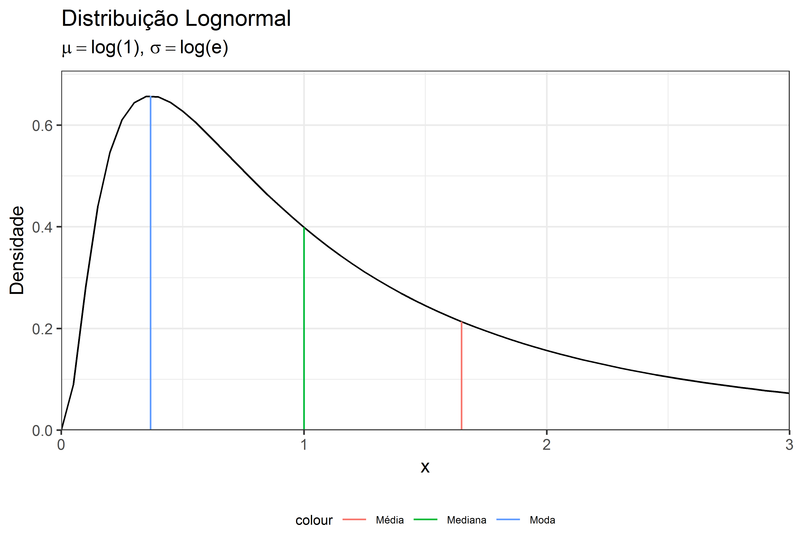
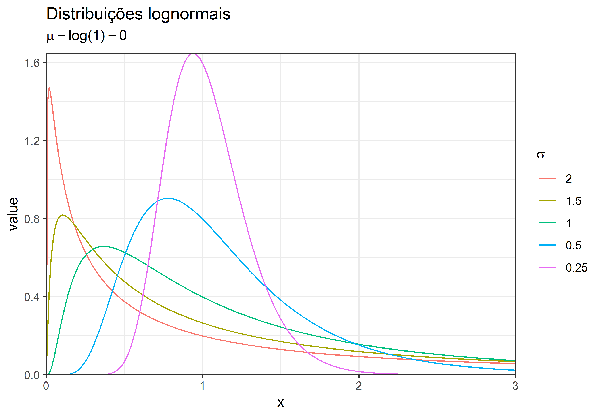

# INTRODUÇÃO

A distribuição lognormal apresenta diversas aplicações práticas. É comum, na área de avaliação de imóveis, mas não apenas[^1], nos depararmos com dados que seguem esta distribuição. Neste artigo pretendemos demonstrar as principais características da distribuição lognormal, sua relação com a distribuição normal de Gauss, assim como debatemos a melhor maneira de se lidar com dados lognormais.

[^1]: Dados estritamente positivos, como valores em moeda, altura, peso, etc, normalmente seguem a distribuição lognormal.

# REVISÃO BIBLIOGRÁFICA

## Formulação

A formulação da distribuição lognormal para os parâmetros $\mu$ e $\sigma$ pode ser vista abaixo [@portalaction]

$$\begin{cases}
f(x;\mu, \sigma) = \frac{1}{x\sigma\sqrt{2\pi}}exp(-\frac{(log(x) - \mu)^2}{2\sigma^2}) & \forall x > 0 \\ 
0 & \text{ se } x = 0 
\end{cases}$$

## Propriedades

### Valor Esperado e Variância

O valor Esperado $\mathbb{E}$ de uma variável aleatória com distribuição lognormal $X$ é [@portalaction]:

$$\mathbb{E}(X) = e^{\mu + \frac{\sigma^2}{2}}$$
E sua variância $Var(X)$ é:

$$Var(X) = e^{2\mu+\sigma^2}(e^{\sigma^2}-1)$$

### Medidas de Tendência Central

A figura \ref{fig:densidade_medidas} mostra a posição das medidas de tendência central (moda, média e mediana) para um variável aleatória de distribuição log-normal.

<div class="figure" style="text-align: center">

<p class="caption">Ilustração das posições de medidas de tendência central numa distribuição lognormal.</p>
</div>

### Efeito das variações do desvio-padrão na forma da distribuição

<div class="figure" style="text-align: center">

<p class="caption">Distribuição lognormal com $\mu = 0$ e diversos valores de $\sigma$</p>
</div>

### Relação com a distribuição normal

Seja $X$ uma variável aleatória de distribuição normal padronizada ($X \sim N(0, 1)$), $F$ a função densidade de probabilidade e $Y = e^X$. Então ($F_Y$) é igual a: 

$$F_Y(y) = \mathbb{P}(e^X\leq y) = \mathbb{P}(X \leq ln(Y)) = \int_{-\infty}^{ln(y)}f_X(x)dx = \int_{-\infty}^{ln(y)}\frac{1}{\sqrt{2\pi}}e^{-x^2/2}dx$$
o que equivale a:

$$F_Y(y) = \int_{0}^{y}\frac{1}{x}\frac{1}{\sqrt{2\pi}}e^{-ln(x)^2/2}$$

Ou seja, a distribuição de uma variável $Y = e^X$, em que $X \sim N(0,1)$ é equivalente a distribuição de uma variável lognormal com parâmetros $\mu = 0$ e $\sigma = 1$.

A figura \ref{fig:normal_lognormal} ilustra este fato.

<div class="figure" style="text-align: center">

<p class="caption">Comparação entre distribuições normal e lognormal padronizadas.</p>
</div>


### Analogia com o Teorema do Limite Central

Assim como o resultado da soma de diversas variáveis independentes com distribuições quaisquer resulta numa variável aleatória de distribuição normal (Teorema do Limite Central), o produto de diversas variáveis aleatórias resulta numa distribuição lognormal.

# EXEMPLO

## Dados

Os dados utilizados aqui são oriundos de Hochheim [-@hochheim, 21-22] e são reproduzidos no [ANEXO I].


## Gráficos

As figuras \ref{fig:densidade} e \ref{fig:hist_densidade} mostram que os valores observados para a variável \code{valor} do conjunto de dados mencionados acima ([@hochheim, 21-22]) apresentam distribuição aproximadamente lognormal, com parâmetros $\mu = \bar{ln(valor)}$

a. Densidade


```r
trellis.par.set(theme=theme.mosaic()) # change default color scheme for lattice
plotDist("lnorm", 
         meanlog = mean(log(dados$valor), na.rm = TRUE),
         sdlog = sd(log(dados$valor), na.rm = TRUE)
         )
```

<div class="figure" style="text-align: center">

<p class="caption">Função densidade de probabilidade com parâmetros obtidos dos dados da variável \code{valor}</p>
</div>

b. Histograma com densidade superposta


```r
histogram(~ valor, data = dados)
plotDist("lnorm", 
         meanlog = mean(log(dados$valor), na.rm = TRUE),
         sdlog = sd(log(dados$valor), na.rm = TRUE), 
         add = TRUE)
```

<div class="figure" style="text-align: center">

<p class="caption">Histograma das variável \code{valor} com função densidade de probabilidade superposta.</p>
</div>

c. Cumulativa


```r
plotDist("lnorm", 
         meanlog = mean(log(dados$valor), na.rm = TRUE),
         sdlog = sd(log(dados$valor), na.rm = TRUE), 
         kind = "cdf")
```

<div class="figure" style="text-align: center">

<p class="caption">Função cumulativa de densidade de probabilidade com parâmetros obtidos dos dados da variável \code{valor}</p>
</div>

d. Distribuição da variável $ln(valor)$

A figura \ref{fig:hist_densidade2}

<div class="figure" style="text-align: center">

<p class="caption">Histograma com função densidade de probabilidade normal superposta</p>
</div>

## Modelos

Detectando-se a presença de variável resposta com distribuição lognormal, pode-se proceder da seguinte maneira:

### Modelo linear com a variável resposta transformada

É fácil mostrar que o modelo linear com a variável resposta logaritmizada, ou seja, com distribuição normal, é melhor ajustado que o modelo linear de uma variável resposta lognormal.

A função máxima verossimilhança de Box-Cox também vai apresentar como transformação ótima a transformação logarítimica, como demonstra a figura \ref{fig:boxcox}


```r
fit <- lm(valor ~. , data = dados)
gg_boxcox(fit)
```

<div class="figure" style="text-align: center">

<p class="caption">Gráfico da função verossimilhança de Box-Cox</p>
</div>

Na tabela \ref{tab:tabela} é possível comparar os modelos com e sem a transformação da variável resposta, assim como o modelo de regressão de poisson, que será visto na próxima seção.


<table style="text-align:center"><caption><strong>Comparação entre modelos com e sem transformação da variável resposta</strong></caption>
<tr><td colspan="4" style="border-bottom: 1px solid black"></td></tr><tr><td style="text-align:left"></td><td colspan="3"><em>Dependent variable:</em></td></tr>
<tr><td></td><td colspan="3" style="border-bottom: 1px solid black"></td></tr>
<tr><td style="text-align:left"></td><td>valor</td><td>log(valor)</td><td>valor</td></tr>
<tr><td style="text-align:left"></td><td><em>OLS</em></td><td><em>OLS</em></td><td><em>Poisson</em></td></tr>
<tr><td style="text-align:left"></td><td>(1)</td><td>(2)</td><td>(3)</td></tr>
<tr><td colspan="4" style="border-bottom: 1px solid black"></td></tr><tr><td style="text-align:left">area_total</td><td>2,893.178</td><td>0.002</td><td>0.002</td></tr>
<tr><td style="text-align:left"></td><td>(2,065.405, 3,720.951)</td><td>(0.001, 0.002)</td><td>(0.002, 0.002)</td></tr>
<tr><td style="text-align:left"></td><td>t = 6.850</td><td>t = 4.886</td><td>t = 994.834</td></tr>
<tr><td style="text-align:left"></td><td>p = 0.00000<sup>***</sup></td><td>p = 0.00002<sup>***</sup></td><td>p = 0.000<sup>***</sup></td></tr>
<tr><td style="text-align:left"></td><td></td><td></td><td></td></tr>
<tr><td style="text-align:left">quartos</td><td>73,524.375</td><td>0.169</td><td>0.161</td></tr>
<tr><td style="text-align:left"></td><td>(-34,814.143, 181,862.894)</td><td>(0.084, 0.255)</td><td>(0.160, 0.161)</td></tr>
<tr><td style="text-align:left"></td><td>t = 1.330</td><td>t = 3.870</td><td>t = 559.819</td></tr>
<tr><td style="text-align:left"></td><td>p = 0.191</td><td>p = 0.0004<sup>***</sup></td><td>p = 0.000<sup>***</sup></td></tr>
<tr><td style="text-align:left"></td><td></td><td></td><td></td></tr>
<tr><td style="text-align:left">suites</td><td>111,000.591</td><td>0.088</td><td>0.091</td></tr>
<tr><td style="text-align:left"></td><td>(8,045.131, 213,956.052)</td><td>(0.007, 0.170)</td><td>(0.090, 0.091)</td></tr>
<tr><td style="text-align:left"></td><td>t = 2.113</td><td>t = 2.121</td><td>t = 384.112</td></tr>
<tr><td style="text-align:left"></td><td>p = 0.041<sup>**</sup></td><td>p = 0.040<sup>**</sup></td><td>p = 0.000<sup>***</sup></td></tr>
<tr><td style="text-align:left"></td><td></td><td></td><td></td></tr>
<tr><td style="text-align:left">garagens</td><td>148,427.448</td><td>0.175</td><td>0.149</td></tr>
<tr><td style="text-align:left"></td><td>(49,657.102, 247,197.795)</td><td>(0.097, 0.253)</td><td>(0.148, 0.149)</td></tr>
<tr><td style="text-align:left"></td><td>t = 2.945</td><td>t = 4.394</td><td>t = 622.946</td></tr>
<tr><td style="text-align:left"></td><td>p = 0.006<sup>***</sup></td><td>p = 0.0001<sup>***</sup></td><td>p = 0.000<sup>***</sup></td></tr>
<tr><td style="text-align:left"></td><td></td><td></td><td></td></tr>
<tr><td style="text-align:left">dist_b_mar</td><td>-223.217</td><td>-0.0003</td><td>-0.0003</td></tr>
<tr><td style="text-align:left"></td><td>(-434.862, -11.571)</td><td>(-0.0004, -0.0001)</td><td>(-0.0003, -0.0003)</td></tr>
<tr><td style="text-align:left"></td><td>t = -2.067</td><td>t = -3.215</td><td>t = -513.533</td></tr>
<tr><td style="text-align:left"></td><td>p = 0.045<sup>**</sup></td><td>p = 0.003<sup>***</sup></td><td>p = 0.000<sup>***</sup></td></tr>
<tr><td style="text-align:left"></td><td></td><td></td><td></td></tr>
<tr><td style="text-align:left">padraomedio</td><td>-146,549.393</td><td>0.268</td><td>0.304</td></tr>
<tr><td style="text-align:left"></td><td>(-354,850.457, 61,751.672)</td><td>(0.103, 0.433)</td><td>(0.302, 0.305)</td></tr>
<tr><td style="text-align:left"></td><td>t = -1.379</td><td>t = 3.190</td><td>t = 414.837</td></tr>
<tr><td style="text-align:left"></td><td>p = 0.176</td><td>p = 0.003<sup>***</sup></td><td>p = 0.000<sup>***</sup></td></tr>
<tr><td style="text-align:left"></td><td></td><td></td><td></td></tr>
<tr><td style="text-align:left">padraoalto</td><td>-56,064.550</td><td>0.334</td><td>0.399</td></tr>
<tr><td style="text-align:left"></td><td>(-264,003.525, 151,874.426)</td><td>(0.169, 0.498)</td><td>(0.398, 0.401)</td></tr>
<tr><td style="text-align:left"></td><td>t = -0.528</td><td>t = 3.975</td><td>t = 539.210</td></tr>
<tr><td style="text-align:left"></td><td>p = 0.600</td><td>p = 0.0003<sup>***</sup></td><td>p = 0.000<sup>***</sup></td></tr>
<tr><td style="text-align:left"></td><td></td><td></td><td></td></tr>
<tr><td style="text-align:left">Constant</td><td>33,953.788</td><td>12.315</td><td>12.374</td></tr>
<tr><td style="text-align:left"></td><td>(-267,469.800, 335,377.375)</td><td>(12.076, 12.553)</td><td>(12.372, 12.376)</td></tr>
<tr><td style="text-align:left"></td><td>t = 0.221</td><td>t = 101.170</td><td>t = 12,963.726</td></tr>
<tr><td style="text-align:left"></td><td>p = 0.827</td><td>p = 0.000<sup>***</sup></td><td>p = 0.000<sup>***</sup></td></tr>
<tr><td style="text-align:left"></td><td></td><td></td><td></td></tr>
<tr><td colspan="4" style="border-bottom: 1px solid black"></td></tr><tr><td style="text-align:left">Observations</td><td>50</td><td>50</td><td>50</td></tr>
<tr><td style="text-align:left">R<sup>2</sup></td><td>0.906</td><td>0.940</td><td></td></tr>
<tr><td style="text-align:left">Adjusted R<sup>2</sup></td><td>0.890</td><td>0.930</td><td></td></tr>
<tr><td style="text-align:left">Log Likelihood</td><td></td><td></td><td>-568,002.625</td></tr>
<tr><td style="text-align:left">Akaike Inf. Crit.</td><td>1,375.659</td><td>-29.275</td><td>1,136,021.250</td></tr>
<tr><td style="text-align:left">Residual Std. Error (df = 42)</td><td>207,903.003</td><td>0.165</td><td></td></tr>
<tr><td style="text-align:left">F Statistic (df = 7; 42)</td><td>57.731<sup>***</sup></td><td>94.063<sup>***</sup></td><td></td></tr>
<tr><td colspan="4" style="border-bottom: 1px solid black"></td></tr><tr><td style="text-align:left"><em>Note:</em></td><td colspan="3" style="text-align:right"><sup>*</sup>p<0.1; <sup>**</sup>p<0.05; <sup>***</sup>p<0.01</td></tr>
</table>

### Regressão de Poisson

Sabendo-se da distribuição log-normal da variável resposta, também é possível efetuar uma regressão de Poisson. A figura \ref{fig:poisson} mostra graficamente os estimadores e seus intervalos de confiança.


```r
plot_model(poisson)
```

<div class="figure" style="text-align: center">

<p class="caption">Estimadores e intervalos de confiança para a regressão de Poisson.</p>
</div>


# CONCLUSÃO

\newpage

# ANEXO I {-}


```
## Warning in kable_styling(., latex_options = "striped"): Please specify
## format in kable. kableExtra can customize either HTML or LaTeX outputs. See
## https://haozhu233.github.io/kableExtra/ for details.
```


|   valor| area_total| quartos| suites| garagens| dist_b_mar|padrao |
|-------:|----------:|-------:|------:|--------:|----------:|:------|
| 1060000|     350.00|       3|      1|        2|        720|medio  |
|  510000|     136.56|       3|      1|        1|        665|medio  |
|  780000|     164.77|       3|      1|        2|        415|medio  |
|  550000|     174.58|       3|      1|        1|        320|medio  |
|  850000|     123.01|       3|      1|        3|        895|alto   |
|  300000|      89.83|       2|      0|        1|        645|baixo  |
|  750000|     174.00|       2|      1|        2|        860|alto   |
|  650000|     123.00|       3|      1|        1|        745|alto   |
|  620000|     121.00|       3|      1|        1|        745|alto   |
|  740000|     109.00|       3|      1|        1|        300|medio  |
|  770000|     170.00|       3|      1|        2|        590|medio  |
|  680000|     141.00|       3|      1|        1|        290|medio  |
|  850000|     174.00|       3|      1|        1|        465|medio  |
|  420000|     105.00|       3|      1|        0|         60|baixo  |
|  547000|     128.00|       3|      1|        1|        745|alto   |
| 1600000|     163.00|       4|      2|        2|         90|alto   |
| 1320000|     230.00|       3|      1|        2|        215|alto   |
|  615000|     108.00|       3|      1|        1|        745|alto   |
|  705000|     174.00|       2|      1|        2|        900|alto   |
|  418000|      85.00|       1|      0|        1|        620|alto   |
|  270000|      71.00|       2|      0|        0|       1380|baixo  |
|  418000|     100.00|       1|      1|        1|        620|alto   |
|  650000|      90.00|       2|      1|        1|        215|alto   |
|  700000|     161.00|       2|      1|        2|        500|alto   |
|  680000|     174.00|       2|      1|        2|        860|alto   |
|  420000|      76.00|       2|      1|        1|        700|baixo  |
|  195000|      48.00|       1|      0|        0|        730|baixo  |
|  290000|      66.00|       1|      0|        1|        745|baixo  |
|  272000|      50.00|       1|      0|        1|       1430|baixo  |
|  430000|      61.00|       2|      0|        1|        170|baixo  |
|  895000|     109.00|       3|      1|        1|        530|medio  |
|  450000|      89.00|       2|      0|        1|        745|medio  |
| 1950000|     393.00|       3|      1|        3|        550|alto   |
| 2150000|     578.00|       3|      2|        3|        260|alto   |
|  940000|     182.00|       3|      1|        2|        200|medio  |
| 1400000|     262.00|       4|      1|        1|         60|alto   |
| 1090000|     205.00|       3|      0|        3|        465|medio  |
| 1272000|     196.00|       3|      3|        2|        610|alto   |
| 2800000|     463.00|       3|      3|        3|        590|alto   |
| 1796000|     273.00|       3|      3|        4|        140|medio  |
| 1400000|     330.00|       4|      2|        2|        655|alto   |
| 3000000|     533.00|       4|      3|        4|        427|alto   |
| 1200000|     221.00|       3|      3|        2|        607|alto   |
|  800000|     220.00|       3|      1|        1|       1000|medio  |
|  950000|     127.00|       2|      1|        1|         60|medio  |
| 2061000|     362.00|       3|      3|        4|        310|alto   |
| 1326000|     315.00|       3|      3|        3|        600|alto   |
|  850000|     151.00|       3|      1|        2|        660|medio  |
| 1650000|     246.00|       3|      3|        3|        307|alto   |
|  650000|     159.72|       3|      1|        1|        120|medio  |

# REFERÊNCIAS {-}
